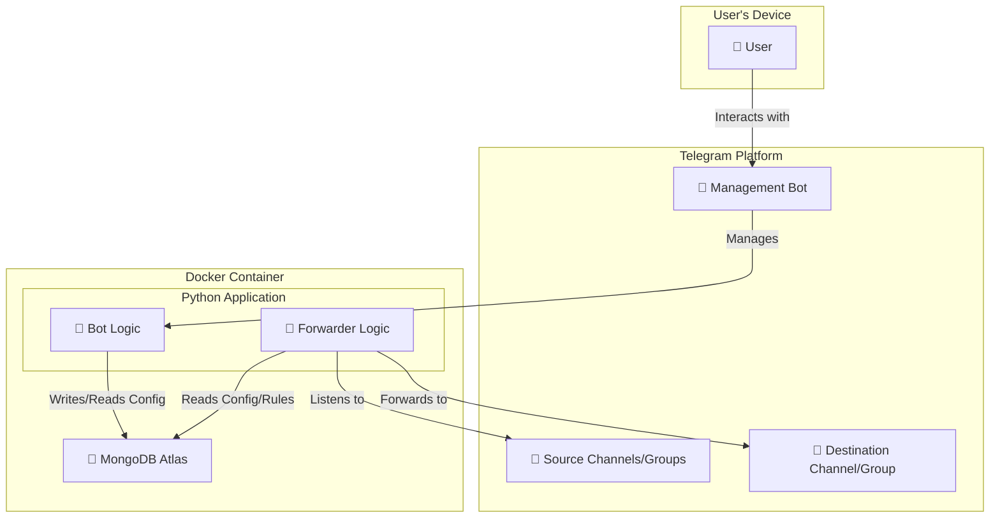

# Telegram Message Forwarder

A powerful Python application to automatically forward messages from multiple Telegram channels and groups to a specific destination, managed entirely through a Telegram bot. This application is containerized using Docker for easy deployment and scalability.

## Architecture

The application runs as a single, unified service that includes a management bot and a forwarder core. Both components interact with a MongoDB database to store user data, sessions, and forwarding rules.



## Key Features

- **Multi-User Support:** Owner can add or remove other users, allowing them to use the bot's features.
- **Comprehensive Rule Management:**
    - **Create & Delete:** Easily add or remove forwarding rules.
    - **Edit Rules:** Modify existing rules, including changing the forwarding style and content type.
    - **Enable/Disable:** Toggle rules on or off without deleting them.
- **Flexible Forwarding Options:**
    - **Real-Time Forwarding:** Instantly forward messages as they arrive.
    - **Batch Forwarding:** Forward historical messages from a specified date range.
    - **Forward by Link:** Forward a specific message using its link.
- **Advanced Content Handling:**
    - **Protected Content:** Automatically handles messages from channels where forwarding is disabled by downloading and re-uploading them.
    - **Content-Type Filtering:** Choose to forward only text, only media, or both.
    - **Custom Forwarding Styles:** Forward messages as a copy (new message) or with the original sender's information.
- **Secure and Isolated:**
    - **Session-Based:** Uses Telethon session strings, so the bot never needs your password.
    - **Dockerized:** The entire application runs in a container, ensuring a consistent and isolated environment.
- **Persistent Storage:** All user data, sessions, and rules are securely stored in a MongoDB database.
- **Logging:** Exports detailed logs to a file for easy debugging and monitoring.

## Setup Instructions

### 1. Prerequisites

- Docker and Docker Compose
- A MongoDB Atlas account
- A Telegram account

### 2. Configuration

1.  **Clone the repository:**
    ```bash
    git clone https://github.com/nullbytef0x/TeleFord.git
    cd TeleFord
    ```

2.  **Create an environment file:**
    ```bash
    cp .env.example .env
    ```

3.  **Edit the `.env` file with your credentials:**
    - `BOT_TOKEN`: Your Telegram bot token from @BotFather.
    - `API_ID` and `API_HASH`: Your Telegram API credentials from [my.telegram.org](https://my.telegram.org).
    - `MONGO_URI`: Your MongoDB connection string.
    - `OWNER_ID`: Your numeric Telegram user ID.

### 3. Generate a Session String

To log in, you need a Telethon session string. Run the provided script to generate one:

```bash
python generate_session.py
```

Enter your `API_ID`, `API_HASH`, and phone number when prompted. The script will print a session string. **Copy this string and save it somewhere safe.**

## Running the Application

The application is designed to run with Docker. To build and start the service, run:

```bash
docker-compose up --build -d
```

To view the logs, you can use:

```bash
docker-compose logs -f
```

## Bot Usage

The bot uses an inline keyboard interface for all actions. Simply send the `/start` command to bring up the main menu.

### Main Menu Options

-   **Session Management:** View, add/update, or delete your Telethon session string.
-   **My Rules:** View, edit, or delete your existing forwarding rules.
-   **Add New Rule:** Create a new rule for real-time message forwarding.
-   **Batch Forward:** Forward historical messages from a specific date range.
-   **Forward by Link:** Forward a specific message by providing its link.
-   **Owner Menu (Owner Only):** Manage users and access owner-specific features.
-   **Help:** Get information about the bot's features.
